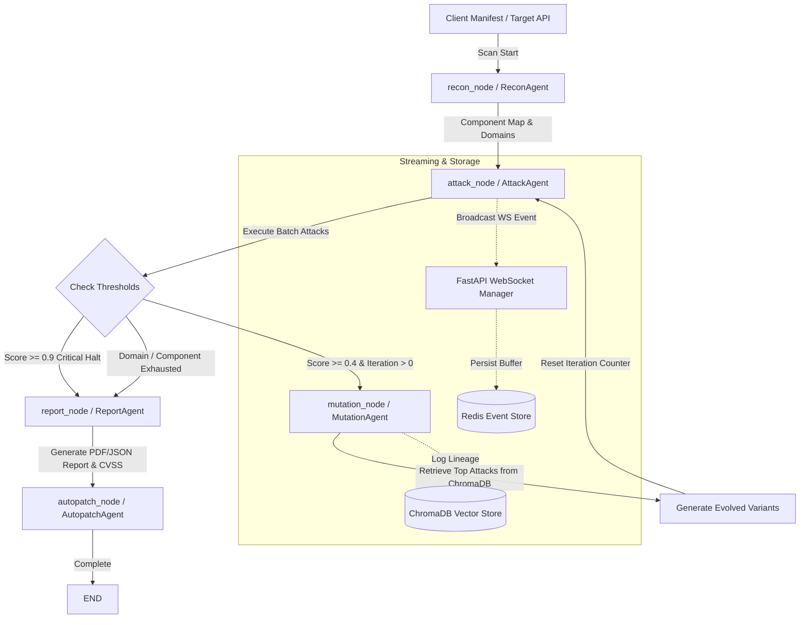

# 🛡️ Sentinel AI — Autonomous AI Infrastructure Security Testing Platform

[](https://python.org)
[](https://fastapi.tiangolo.com)
[](https://github.com/langchain-ai/langgraph)
[](https://www.trychroma.com)
[](https://redis.io)
[](https://react.dev)
[](https://tailwindcss.com)
[](LICENSE)

> **AI Penetration Testing as a Service — Like Burp Suite for LLMs and AI Application Stacks.**  
> Fully automated, iterative, multi-agent penetration testing that discovers attack surfaces, executes targeted exploits, mutates successful payloads, generates CVSS-scored reports, and streams events live to a real-time War Room Dashboard.

---

## 📋 Table of Contents

- [Overview](#-overview)
- [Key Features](#-key-features)
- [System Architecture](#-system-architecture)
- [The 5-Agent Suite](#-the-5-agent-suite)
- [Attack Domains Covered](#-attack-domains-covered)
- [Tech Stack](#-tech-stack)
- [Project Directory Structure](#-project-directory-structure)
- [Getting Started & Quickstart](#-getting-started--quickstart)
  - [Prerequisites](#1-prerequisites)
  - [Environment Setup](#2-environment-setup)
  - [Running Redis & Target Sandbox](#3-running-redis--dummy-target)
  - [Launching Backend & Frontend](#4-launching-backend--frontend)
- [WebSocket Live Event Schema](#-websocket-live-event-schema)
- [Testing & Verification](#-testing--verification)
- [License](#-license)

---

## 🎯 Overview

**Sentinel AI** is designed for security engineers and DevOps teams building on modern AI infrastructure. Traditional static scanners or basic prompt injection checklists fail to capture how real-world attackers bypass AI guardrails. 

Sentinel AI deploys an **autonomous, self-evolving multi-agent state machine** powered by **LangGraph**. It tests target AI components step-by-step, learns from responses, dynamically mutates payload variants to evade filters, persists attack lineage in a **ChromaDB vector database**, and compiles executive PDF/JSON vulnerability reports with **CVSS 3.1 scoring**.

---

## ✨ Key Features

- 🤖 **5-Agent Pipeline**: Specialized agents for Recon, Attack, Mutation, Reporting, and Remediation.
- 🧬 **Iterative Payload Evolution**: DeepSeek-powered mutation engine generating targeted variants (*semantic rephrase, role injection, context extension, encoding obfuscation, language switching*).
- ⚡ **Real-time Live War Room**: React 18 + Tailwind CSS v4 dashboard streaming live scan metrics, attack logs, and vulnerability telemetry over WebSockets.
- 🔄 **Redis Reconnect Buffer**: High-availability WebSocket buffer (`scan_events:{scan_id}`) storing event logs in Redis so clients reconnect mid-scan without losing state.
- 📦 **Persistent Multi-Tenant Vector Store**: ChromaDB vector database with strict `client_id` data isolation across attack histories, successful exploits, and mutation lineages.
- 📄 **Executive & Technical PDF Reports**: Automated PDF generation via ReportLab complete with executive summaries, CVSS 3.1 scores, severity breakdowns, and actionable remediation roadmaps.
- 🛡️ **Safety & Control Mechanisms**: Automated **Critical Halt** (triggers on score $\ge 0.9$), **No-Improvement Stopping**, and rate-limiting (`ATTACK_RATE_LIMIT`) to protect target systems.

---

## 🏗️ System Architecture

Sentinel AI coordinates execution across multiple agents using a centralized **LangGraph `ScanState` state machine**.



---

## 🤖 The 5-Agent Suite

Each agent inherits from `BaseAgent` (`agents/base_agent.py`), equipping it with automated API key rotation (`ApiKeyManager`), exponential backoff, rate limiting, and standard LangGraph state interactions.

| Agent | Module | Model / Engine | Role & Capabilities |
| :--- | :--- | :--- | :--- |
| **ReconAgent** | `agents/recon_agent.py` | Groq Llama 3.1 70B | Discovers attack surface, probes HTTP endpoints, fingerprints model frameworks, and assigns priority scores (1-10). |
| **AttackAgent** | `agents/attack_agent.py` | Groq Llama 3.1 70B | Loads domain attack templates, executes HTTP payloads against target endpoints, scores responses (0.0 - 1.0), and logs attempts. |
| **MutationAgent** | `agents/mutation_agent.py` | DeepSeek | Fetches top successful exploits from ChromaDB and generates evolved mutation variants to bypass active filters. |
| **ReportAgent** | `agents/report_agent.py` | Gemini 2.5 / Pro | Aggregates findings, calculates CVSS 3.1 scores, generates executive summaries, technical breakdowns, and renders PDF/JSON exports. |
| **AutopatchAgent** | `agents/autopatch_agent.py` | Skeleton / Future | Analyzes confirmed vulnerabilities to generate automated code remediation patches and Pull Requests. |

---

## 🥊 Attack Domains Covered

Sentinel AI ships with **52+ pre-built security testing templates** across 4 primary attack domains (`domains/domain_library.py`):

1. 💉 **Indirect Prompt Injection**: Data poison injection, third-party system instruction override, context leakage.
2. 🔓 **System Prompt Extraction**: Guardrail bypass, persona takeover, system prompt leakage, developer instruction dump.
3. 📚 **RAG Poisoning**: Knowledge base context manipulation, retrieval hijack, false fact injection.
4. 🔌 **API Security & Function Abuse**: Unauthorized tool call injection, schema manipulation, parameter tampering, SSRF via agent function tools.

---

## 🛠️ Tech Stack

### Backend & Core Logic
- **Framework**: Python 3.11+, FastAPI, Uvicorn
- **Orchestration**: LangGraph, Asyncio
- **Database & Storage**: ChromaDB (Vector Store), Redis (Replay Buffer)
- **Reporting**: ReportLab (PDF Generation), PyPDF2

### LLM Integrations & Resiliency
- **Models**: Groq (Llama 3.1 70B), DeepSeek, Google Gemini (2.5 / Pro), Ollama (Local sandbox)
- **Fault Tolerance**: `Tenacity` retry logic with automatic multi-key rotation (`ApiKeyManager`) on `ResourceExhausted` (429) & `ServerError` (503).

### Frontend Dashboard
- **Framework**: React 18, Vite
- **Styling**: Tailwind CSS v4, Shadcn UI, Lucide Icons
- **State & Routing**: Zustand (`scanStore.js`), React Router v6
- **Visualization**: Recharts, D3.js

---

## 📂 Project Directory Structure

```
sentinel-core/
├── agents/                     # Multi-Agent Implementations
│   ├── api_key_manager.py      # LLM API key rotation manager
│   ├── attack_agent.py         # Attack execution engine
│   ├── base_agent.py           # Base agent class with retries & backoff
│   ├── cvss_tables.py          # CVSS 3.1 scoring approximation tables
│   ├── exceptions.py          # Custom domain exceptions
│   ├── mutation_agent.py       # Evolutionary mutation engine
│   ├── orchestrator.py         # LangGraph state machine workflow
│   ├── recon_agent.py          # Surface mapping agent
│   ├── report_agent.py         # Report generation & CVSS mapper
│   └── report_styles.py        # PDF styling palette & layout configs
├── backend/                    # FastAPI Server & WebSocket Manager
│   └── main.py                 # API routes, WS connection manager, Redis buffer
├── domains/                    # Attack Templates & Libraries
│   ├── domain_library.py       # Template catalog manager
│   └── templates/              # JSON attack template definitions
├── dummy_target/               # Vulnerable Sandbox App for Local Dev Testing
│   └── app.py                  # FastAPI victim target with mock LLM endpoint
├── frontend/                   # Live War Room Web Dashboard
│   ├── src/
│   │   ├── pages/              # Dashboard, ScanHistory, Onboarding views
│   │   ├── store/              # Zustand global scan state store
│   │   └── index.css           # Tailwind v4 theme configurations
│   ├── vite.config.js          # Vite config with @ alias & Tailwind plugin
│   └── package.json
├── knowledge_base/             # Vector Database Interfaces
│   ├── chroma_client.py        # Thread-safe ChromaDB client singleton
│   └── knowledge_base.py       # High-level multitenant ChromaDB API
├── tests/                      # Automated Test Suite (Integration & Unit)
├── constants.py                # System thresholds, events, and key mappings
└── requirements.txt            # Python dependencies
```

---

## 🚀 Getting Started & Quickstart

### 1. Prerequisites

- **Python**: 3.11 or higher
- **Node.js**: v18 or higher (for Frontend)
- **Redis**: Running locally or via Docker on port `6379`
- **Ollama**: (Optional for local dummy target) `ollama pull mistral`

---

### 2. Environment Setup

Clone the repository and set up a virtual environment:

```bash
# Clone repository
git clone https://github.com/blackblizzard01/sentinel-core.git
cd sentinel-core

# Create and activate Python virtual environment
python -m venv venv

# Windows CMD:
venv\Scripts\activate

# Linux / MacOS:
source venv/bin/activate

# Install dependencies
pip install -r requirements.txt
```

Create a `.env` file in the root directory:

```env
GROQ_API_KEYS="gsk_key1,gsk_key2"
GEMINI_API_KEYS="AIza_key1,AIza_key2"
DEEPSEEK_API_KEYS="sk_key1,sk_key2"
REDIS_URL="redis://localhost:6379"
```

---

### 3. Running Redis & Dummy Target

#### Start Redis Container
```bash
docker run -d --name sentinel-redis -p 6379:6379 redis:latest
```

#### Start the Local Target Sandbox (Terminal 1)
```bash
uvicorn dummy_target.app:app --port 8001
```

---

### 4. Launching Backend & Frontend

#### Start the Sentinel Backend API (Terminal 2)
```bash
uvicorn backend.main:app --reload --host 0.0.0.0 --port 8000
```

#### Start the Frontend War Room (Terminal 3)
```bash
cd frontend
npm install
npm run dev
```
Open `http://localhost:5173` in your browser to access the War Room Dashboard.

#### Trigger a Manual Dev Scan
You can launch an end-to-end scan against the local target sandbox:
```bash
curl -X POST http://localhost:8000/dev/trigger-scan
```

---

## 📡 WebSocket Live Event Schema

The frontend connects to `ws://localhost:8000/ws/scan/{scan_id}` to receive real-time telemetry. Key events emitted during a scan:

| Event Type | Emitted By | Payload Description |
| :--- | :--- | :--- |
| `agent_started` | Orchestrator | Triggered when an agent node begins execution (`agent_name`, `phase`, `component_id`). |
| `attack_executed` | `attack_node` | Broadcasts executed payload preview, target response preview, and attempt score. |
| `vulnerability_found` | `attack_node` | Emitted whenever an attack score meets or exceeds `SUCCESS_THRESHOLD` ($\ge 0.7$). |
| `mutation_occurred` | `mutation_node` | Emitted when a new payload variant is generated (`parent_attack_id`, `child_attack_id`, `strategy`). |
| `critical_halt` | `attack_node` | Fired when a critical vulnerability ($\ge 0.9$) triggers an emergency scan halt. |
| `scan_complete` | Orchestrator | Final summary containing vulnerability counts, severity totals, and generated PDF report path. |

---

## 🧪 Testing & Verification

Run the full pytest suite to verify agent logic, orchestrator state transitions, ChromaDB tenant isolation, and CVSS reporting:

```bash
# Run full integration test suite
pytest

# Run specific test modules
pytest tests/test_week1_smoke.py
pytest tests/test_week2_integration.py
pytest tests/test_report_agent_cvss.py
pytest tests/test_recon_agent.py
```

---

## 📜 License

Distributed under the **MIT License**. See `LICENSE` for more information.
